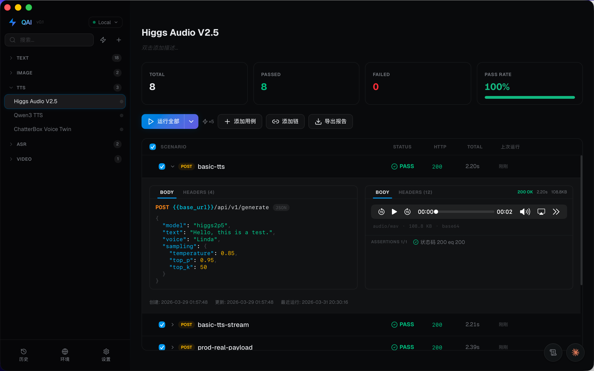

<div align="center">


# QAI

**AI-Powered API Testing Tool**

The Postman alternative with a brain. QAI analyzes your code and docs to automatically generate test cases — so you can stop writing boilerplate and start shipping.

[](https://github.com/xiaoshicae/qai/releases)
[](LICENSE)
[]()
[](https://www.rust-lang.org)
[](https://tauri.app)

[Download](#download) · [Features](#features) · [Getting Started](#getting-started) · [Development](#development)

</div>

---

<p align="center"></p>

## Why QAI?

| | Postman | QAI |
|---|---|---|
| AI test generation | Limited (paid) | Built-in, bring your own API key |
| Desktop performance | Electron (heavy) | Tauri + Rust (native, ~13MB) |
| Privacy | Cloud-synced | 100% local, your data never leaves |
| Price | Freemium | Free & open source |

## Features

### Core

- **HTTP Client** — GET, POST, PUT, DELETE, PATCH with full header/query/body control
- **Collections & Folders** — Organize requests into nested tree structures with drag & drop
- **Environment Variables** — `{{variable}}` syntax with multiple environments
- **Assertions** — Status code, JSON Path, body contains, response time, header checks
- **Chain Execution** — Run requests in sequence with variable extraction between steps
- **Batch Execution** — Run entire collections in parallel with real-time progress

### AI-Powered

- **Auto-Generate Test Cases** — Point AI at your API docs or code, get complete test suites
- **Smart Assertions** — AI suggests meaningful assertions based on response structure
- **AI Chat** — Ask questions about your API, debug failures, get suggestions

### Developer Experience

- **WebSocket Support** — Connect, send messages, monitor real-time streams
- **cURL Import/Export** — Paste a cURL command, get a ready-to-run request
- **HTML Reports** — Export beautiful test execution reports
- **Built-in Terminal** — PTY-backed terminal right inside the app
- **MCP Server** — Expose your test collections as MCP tools for AI agents
- **Dark & Light Themes** — Polished UI with system theme detection
- **i18n** — English and Chinese out of the box

## Download

<table>
<tr>
<td align="center"><b>macOS</b></td>
<td align="center"><b>Windows</b></td>
<td align="center"><b>Linux</b></td>
</tr>
<tr>
<td align="center">
<a href="https://github.com/xiaoshicae/qai/releases/latest">
Apple Silicon (.dmg)<br>
Intel (.dmg)
</a>
</td>
<td align="center">
<a href="https://github.com/xiaoshicae/qai/releases/latest">
64-bit (.msi)<br>
64-bit (.exe)
</a>
</td>
<td align="center">
<a href="https://github.com/xiaoshicae/qai/releases/latest">
.deb<br>
.AppImage
</a>
</td>
</tr>
</table>

> **macOS note**: The app is not code-signed. On first open, right-click the app and select "Open", then confirm. You only need to do this once.

## Getting Started

1. **Download & Install** from the [latest release](https://github.com/xiaoshicae/qai/releases/latest)
2. **Create a Collection** — Click "+" in the sidebar to start a new test suite
3. **Add Requests** — Set method, URL, headers, body — just like Postman
4. **Run & Assert** — Hit Send, add assertions, verify your API works
5. **(Optional) AI Setup** — Go to Settings, add your AI API key, then let AI generate test cases for you

## Tech Stack

| Layer | Technology |
|-------|-----------|
| Backend | **Rust** — Tauri 2.0, reqwest, rusqlite, tokio |
| Frontend | **React 19** — TypeScript, Vite, Tailwind CSS 4, Zustand |
| Database | **SQLite** — WAL mode, fully local |
| AI | **Claude / OpenAI compatible** — Bring your own API key |

## Development

```bash
# Prerequisites: Rust 1.77+, Node.js 22+, npm

# Clone
git clone https://github.com/xiaoshicae/qai.git
cd qai

# Install frontend dependencies
npm install

# Run in dev mode (hot reload)
cargo tauri dev

# Run tests
cd src-tauri && cargo test

# Production build
cargo tauri build
```

## Contributing

Contributions are welcome! Please feel free to submit a Pull Request.

1. Fork the repository
2. Create your feature branch (`git checkout -b feat/amazing-feature`)
3. Commit your changes (`git commit -m '@feat: add amazing feature'`)
4. Push to the branch (`git push origin feat/amazing-feature`)
5. Open a Pull Request

## License

[MIT](LICENSE) — use it however you want.

---

<div align="center">

**If QAI saves you time, consider giving it a star!**

</div>
